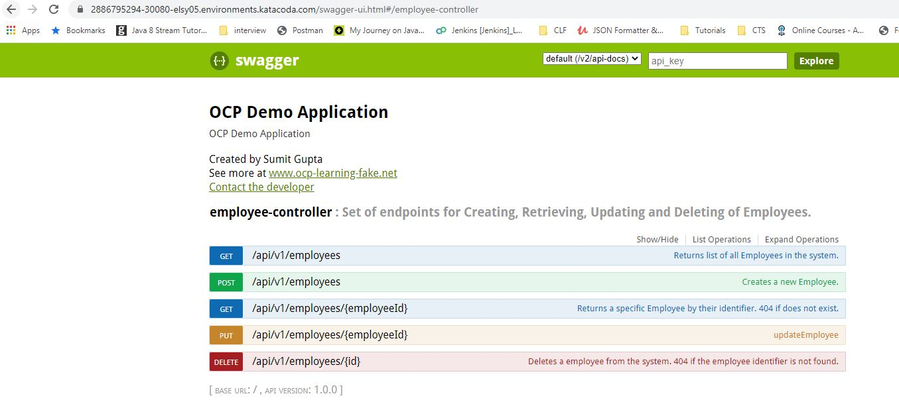

# OCP Demo APP


*	this is simple application with curd api's for employee model.

	```
	  {
	    "emailId": "string",
	    "firstName": "string",
	    "id": 0,
	    "lastName": "string"
	  }
	```
*	Here are the list of api's 

 


*	This application is using **postgresql as database**.


# Build docker image and run

## Docker Compose

Compose is a tool for defining and running multi-container Docker applications. With Compose, you use a YAML file to configure your application’s services. 
Then, with a single command, you create and start all the services from your configuration. To learn more about all the features of Compose, see the list of features.
Compose works in all environments: production, staging, development, testing, as well as CI workflows. You can learn more about each case in Common Use Cases.
Using Compose is basically a three-step process:


1.  Define your app’s environment with a Dockerfile so it can be reproduced anywhere.
2.	Define the services that make up your app in docker-compose.yml so they can be run together in an isolated environment.
3.	Run docker-compose up and Compose starts and runs your entire app


Compose has commands for managing the whole lifecycle of your application:

*	Start, stop, and rebuild services
*	View the status of running services
*	Stream the log output of running services
*	Run a one-off command on a service

Make sure you are at folder /ocp-demo-app/ocp-demo-app-db and run below command

*   **build images**, this command will use the **DockerFile** to first create spring boot jar then build the image 
* 	This command will use the default file name **docker-compose.yml** 
* 	Here is the content of docker-compose.yml

	`
	version: '3.3'
	services:
	  postgresql:
	    image: 'postgres:13.1-alpine' 
	    container_name: postgresql
	    environment:
	     - POSTGRES_DB=sample_database
	     - POSTGRES_USER=postgresql_user
	     - POSTGRES_PASSWORD=postgresql_password
	  
	  ocp-demo-app-db:
	    build: .
	    container_name: ocp-demo-app-db
	    ports:
	      - 8080:8080
	    depends_on:
	      - postgresql
	    environment:
	      - POSTGRESQL_DB_NAME=sample_database
	      - POSTGRESQL_USER=postgresql_user
	      - POSTGRESQL_PASSWORD=postgresql_password
	      - POSTGRESQL_SERVICE_NAME=postgresql
      `


*	Now lets **create/build** image for ocp-demo-app-db

	$ docker-compose build
	
	
* 	this command will create image for ocp-demo-app-db and you can verify this with docker images comamnd

	$ docker images
	
	
 
	
*   **run the application**, use below command to run the application


	$ docker-compose up -d

* 	This will also create a default network

 	


* 	here are the process,containers & images in use by docker-compose

 	


# Kubernetes


*	build image and push to docker hub	

*	use below commands to create image and tag and push to docker hub

*	go to folder /ocp-demo-app/ocp-demo-app-db

*	build image with required tag

	$ docker build . -t sumitgupta28/ocp-demo-app-db
	
*	this will create docker image with tag	**sumitgupta28/ocp-demo-app-db:latest**

*	docker login
	
	$ docker login

*	docker push

	$ docker push sumitgupta28/ocp-demo-app-db
	
	
 

 


*	go to folder **/ocp-demo-app/ocp-demo-app-db/kubernetes** and run below command

	```
	$ kubectl apply -f .
	deployment.apps/ocp-demo-app-db created
	service/ocp-demo-app-db created
	configmap/postgres-configuration created
	service/postgresql created
	statefulset.apps/postgres-statefulset created
	persistentvolume/postgres-pv created
	persistentvolumeclaim/postgres-pv-claim created
	```

 


*	This command will execute all the yml files under the kubernetes folder and create below kubernetes objects 

	```
	$ kubectl get all
	NAME                                   READY   STATUS    RESTARTS   AGE
	pod/ocp-demo-app-db-776db59bf4-845dx   1/1     Running   0          24m
	pod/ocp-demo-app-db-776db59bf4-gmvr8   1/1     Running   0          24m
	pod/ocp-demo-app-db-776db59bf4-ltnrh   1/1     Running   0          24m
	pod/postgres-statefulset-0             1/1     Running   0          26m
	
	NAME                      TYPE        CLUSTER-IP      EXTERNAL-IP   PORT(S)          AGE
	service/ocp-demo-app-db   NodePort    10.110.127.32   <none>        8080:30080/TCP   14m
	service/postgresql        NodePort    10.98.240.12    <none>        5432:32760/TCP   26m
	
	NAME                              READY   UP-TO-DATE   AVAILABLE   AGE
	deployment.apps/ocp-demo-app-db   3/3     3            3           24m
	
	NAME                                         DESIRED   CURRENT   READY   AGE
	replicaset.apps/ocp-demo-app-db-776db59bf4   3         3         3       24m
	
	NAME                                    READY   AGE
	statefulset.apps/postgres-statefulset   1/1     26m

	```

*	**persistentvolume/postgres-pv** - this is a Persistent Volume for postgres database

*	**persistentvolumeclaim/postgres-pv-claim** - this is a Persistent Volume Claim for postgres-pv postgres database

*	**configmap/postgres-configuration** - this is a config map for possgres sql credentials  

*	**statefulset.apps/postgres-statefulset** - This is pod for postgres sql 

*	**service/postgresql** - postgre-sql exposed as postgresql service name

* 	**deployment.apps/ocp-demo-app-db** - This is deployment for **sumitgupta28/ocp-demo-app-db:latest** image with 3 replicas

*	**service/ocp-demo-app-db** - This is a service for ocp-demo-app-db deployemnt.

*	application can be accessible as http://<<hostname>>:30080/swagger-ui.html

 


*	Can verify the swagger json a http://<<hostname>>:30080/v2/api-docs

	```
		{
	   "swagger":"2.0",
	   "info":{
	      "description":"OCP Demo Application",
	      "version":"1.0.0",
	      "title":"OCP Demo Application",
	      "contact":{
	         "name":"Sumit Gupta",
	         "url":"www.ocp-learning-fake.net",
	         "email":"sumitgupta28@gmail.com"
	      },
	      "license":{
	         
	      }
	   },
	   "host":"2886795294-30080-elsy05.environments.katacoda.com",
	   "basePath":"/",
	   "tags":[
	      {
	         "name":"employee-controller",
	         "description":"Set of endpoints for Creating, Retrieving, Updating and Deleting of Employees."
	      }
	   ],
	   "paths":{
	      "/api/v1/employees":{
	         "get":{
	            "tags":[
	               "employee-controller"
	            ],
	            "summary":"Returns list of all Employees in the system.",
	            "operationId":"getAllEmployeesUsingGET",
	            "consumes":[
	               "application/json"
	            ],
	            "produces":[
	               "application/json"
	            ],
	            "responses":{
	               "200":{
	                  "description":"OK",
	                  "schema":{
	                     "type":"array",
	                     "items":{
	                        "$ref":"#/definitions/Employee"
	                     }
	                  }
	               },
	               "401":{
	                  "description":"Unauthorized"
	               },
	               "403":{
	                  "description":"Forbidden"
	               },
	               "404":{
	                  "description":"Not Found"
	               }
	            }
	         },
	         "post":{
	            "tags":[
	               "employee-controller"
	            ],
	            "summary":"Creates a new Employee.",
	            "operationId":"createEmployeeUsingPOST",
	            "consumes":[
	               "application/json"
	            ],
	            "produces":[
	               "application/json"
	            ],
	            "parameters":[
	               {
	                  "in":"body",
	                  "name":"employee",
	                  "description":"employee",
	                  "required":true,
	                  "schema":{
	                     "$ref":"#/definitions/Employee"
	                  }
	               }
	            ],
	            "responses":{
	               "200":{
	                  "description":"OK",
	                  "schema":{
	                     "$ref":"#/definitions/Employee"
	                  }
	               },
	               "201":{
	                  "description":"Created"
	               },
	               "401":{
	                  "description":"Unauthorized"
	               },
	               "403":{
	                  "description":"Forbidden"
	               },
	               "404":{
	                  "description":"Not Found"
	               }
	            }
	         }
	      },
	      "/api/v1/employees/{employeeId}":{
	         "get":{
	            "tags":[
	               "employee-controller"
	            ],
	            "summary":"Returns a specific Employee by their identifier. 404 if does not exist.",
	            "operationId":"getEmployeeByIdUsingGET",
	            "consumes":[
	               "application/json"
	            ],
	            "produces":[
	               "application/json"
	            ],
	            "parameters":[
	               {
	                  "name":"employeeId",
	                  "in":"path",
	                  "description":"Id of the employee to be obtained. Cannot be empty.",
	                  "required":false,
	                  "type":"integer",
	                  "format":"int32"
	               }
	            ],
	            "responses":{
	               "200":{
	                  "description":"OK",
	                  "schema":{
	                     "$ref":"#/definitions/Employee"
	                  }
	               },
	               "401":{
	                  "description":"Unauthorized"
	               },
	               "403":{
	                  "description":"Forbidden"
	               },
	               "404":{
	                  "description":"Not Found"
	               }
	            }
	         },
	         "put":{
	            "tags":[
	               "employee-controller"
	            ],
	            "summary":"updateEmployee",
	            "operationId":"updateEmployeeUsingPUT",
	            "consumes":[
	               "application/json"
	            ],
	            "produces":[
	               "*/*"
	            ],
	            "parameters":[
	               {
	                  "name":"employeeId",
	                  "in":"path",
	                  "description":"employeeId",
	                  "required":true,
	                  "type":"integer",
	                  "format":"int32"
	               },
	               {
	                  "in":"body",
	                  "name":"employeeDetails",
	                  "description":"employeeDetails",
	                  "required":true,
	                  "schema":{
	                     "$ref":"#/definitions/Employee"
	                  }
	               }
	            ],
	            "responses":{
	               "200":{
	                  "description":"OK",
	                  "schema":{
	                     "$ref":"#/definitions/Employee"
	                  }
	               },
	               "201":{
	                  "description":"Created"
	               },
	               "401":{
	                  "description":"Unauthorized"
	               },
	               "403":{
	                  "description":"Forbidden"
	               },
	               "404":{
	                  "description":"Not Found"
	               }
	            }
	         }
	      },
	      "/api/v1/employees/{id}":{
	         "delete":{
	            "tags":[
	               "employee-controller"
	            ],
	            "summary":"Deletes a employee from the system. 404 if the employee identifier is not found.",
	            "operationId":"deleteEmployeeUsingDELETE",
	            "consumes":[
	               "application/json"
	            ],
	            "produces":[
	               "*/*"
	            ],
	            "parameters":[
	               {
	                  "name":"id",
	                  "in":"path",
	                  "description":"Id of the Employee to be deleted. Cannot be empty.",
	                  "required":false,
	                  "type":"integer",
	                  "format":"int32"
	               }
	            ],
	            "responses":{
	               "200":{
	                  "description":"OK",
	                  "schema":{
	                     "type":"object",
	                     "additionalProperties":{
	                        "type":"boolean"
	                     }
	                  }
	               },
	               "401":{
	                  "description":"Unauthorized"
	               },
	               "204":{
	                  "description":"No Content"
	               },
	               "403":{
	                  "description":"Forbidden"
	               }
	            }
	         }
	      }
	   },
	   "definitions":{
	      "Employee":{
	         "type":"object",
	         "properties":{
	            "emailId":{
	               "type":"string"
	            },
	            "firstName":{
	               "type":"string"
	            },
	            "id":{
	               "type":"integer",
	               "format":"int32"
	            },
	            "lastName":{
	               "type":"string"
	            }
	         }
	      }
	   }
	}
	```
