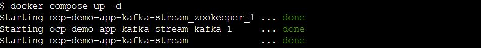

# OCP Demo APP

*	This is simple application to demonstrate the spring-cloud-stream with kafka.
*	Just to keep it simple same spring boot application will act as producer and consumer. 
*	Below image show the the exposed api's and flow.  

 

# Build docker image and run

## Docker Compose

Compose is a tool for defining and running multi-container Docker applications. With Compose, you use a YAML file to configure your application’s services. 
Then, with a single command, you create and start all the services from your configuration. To learn more about all the features of Compose, see the list of features.
Compose works in all environments: production, staging, development, testing, as well as CI workflows. You can learn more about each case in Common Use Cases.
Using Compose is basically a three-step process:

1.  Define your app’s environment with a Dockerfile so it can be reproduced anywhere.
2.	Define the services that make up your app in docker-compose.yml so they can be run together in an isolated environment.
3.	Run docker-compose up and Compose starts and runs your entire app

Compose has commands for managing the whole lifecycle of your application:

*	Start, stop, and rebuild services
*	View the status of running services
*	Stream the log output of running services
*	Run a one-off command on a service

Make sure you are at folder /ocp-demo-app/ocp-demo-app-kafka and run below command

*   **build images**, this command will use the **DockerFile** to first create spring boot jar then build the image 
* 	This command will use the default file name **docker-compose.yml** 
* 	Just for demo purpose we are creating only 1-1 instance of zookeeper and kafka. 

* 	Here is the content of docker-compose.yml
	
	version: '3.3'

	services:
	  zookeeper:
	    image: confluentinc/cp-zookeeper
	    ports:
	      - 2181:2181
	    environment:
	      - ALLOW_ANONYMOUS_LOGIN=yes
	      - ZOOKEEPER_CLIENT_PORT=2181
	
	  kafka:
	    image: confluentinc/cp-kafka
	    depends_on:
	      - zookeeper
	    ports:
	      - 9092:9092
	    environment:
	      - KAFKA_BROKER_ID=1
	      - KAFKA_ZOOKEEPER_CONNECT=zookeeper:2181
	      - KAFKA_ADVERTISED_LISTENERS=PLAINTEXT://localhost:9092
	      - KAFKA_LISTENER_SECURITY_PROTOCOL_MAP=PLAINTEXT:PLAINTEXT,PLAINTEXT_HOST:PLAINTEXT
	      - KAFKA_INTER_BROKER_LISTENER_NAME=PLAINTEXT
	      - KAFKA_OFFSETS_TOPIC_REPLICATION_FACTOR=1
	      - KAFKA_AUTO_CREATE_TOPICS_ENABLE=true
	      
	  ocp-demo-app-kafka:
	    build: .
	    container_name: ocp-demo-app-kafka-stream
	    depends_on:
	      - zookeeper
	      - kafka
	
	    ports:
	      - 8080:8080
	    environment:
	      - KAFKA_ENDPOINT=localhost:9092

* 	Before running this , you would like to replace the **localhost** with your ip address. 

	$ sed -i 's/localhost|X.X.X.X/g'

*	Now lets **create/build** image for ocp-demo-app-kafka

	$ docker-compose build
	
	
* 	this command will create image for ocp-demo-app-kafka and you can verify this with docker images comamnd

	$ docker images
	
	
 
	
*   **run the application**, use below command to run the application

	$ docker-compose up -d

* 	This will also create a default network

 	

* 	here are the process,containers & images in use by docker-compose

 	

# Kubernetes

*	build image and push to docker hub	

*	use below commands to create image and tag and push to docker hub

*	go to folder /ocp-demo-app/ocp-demo-app-db

*	build image with required tag

	$ docker build . -t sumitgupta28/ocp-demo-app-kafka-stream
	
*	this will create docker image with tag	**sumitgupta28/ocp-demo-app-kafka-stream:latest**

*	docker login
	
	$ docker login

*	docker push

	$ docker push sumitgupta28/ocp-demo-app-kafka-stream
	
	
 

 

Since now we have pushed the producer/consumer app to docker hub. so let try to deploy app on kubernates. 

Just for understanding to start with we will do the **kafka cluster creation with plain-yaml approach** for now and later we will see the **helm charts and Operators**. 

#### Kafka

> Apache Kafka is a scalable and fault-tolerant distributed message broker, and it can handle large volumes of real-time data efficiently. 

> Compared to other message brokers such as RabbitMQ or ActiveMQ, it has a much higher throughput.

> Kafka's pub/sub messaging system is probably the most widely used feature, 

> however we can also use it for log aggregation since it provides persistent storage for published messages.

 

> Kafka has 5 components:

> 1.    **Topic**: A topic is a category or feed name to which messages are published by the message producers. Topics are partitioned and each partition is represented by the ordered immutable sequence of messages. Each message in the partition is assigned a unique sequential ID (offset).
> 2. 	**Broker**: A Kafka cluster consists of servers where each one may have server processes (brokers). Topics are created within the context of broker processes.
> 3. 	**Zookeeper**: Zookeeper serves as the coordinator between the Kafka broker and consumers.
> 4. 	**Producers**: Producers publish data to the topics by choosing the appropriate partition within the topic.
> 5. 	**Consumers**: Consumers are the applications or processes that subscribe to topics and process the feed of published messages.
 
 
 
 
### Kubernetes YAML 

Refer to **\kubernetes\ocp-demo-app-kafka.yml**

> 1.    **Create Zookeeper Deployment and Service**:

This will create Zookeeper Deployment with 1 replica and zookeeper service

	
	apiVersion: apps/v1
	kind: Deployment
	metadata:
	  labels:
	    app: zookeeper
	  name: zookeeper
	
	spec:
	  replicas: 1
	  selector:
	    matchLabels:
	      app: zookeeper
	  template:
	    metadata:
	      labels:
	        app: zookeeper
	    spec:
	      containers:
	      - image: library/zookeeper:3.4.13
	        imagePullPolicy: IfNotPresent
	        name: zookeeper
	        ports:
	        - containerPort: 2181
	        env:
	        - name: ZOO_MY_ID
	          value: "1"
		
	---

	apiVersion: v1
	kind: Service
	metadata:
	  labels:
	    app: zookeeper-service
	  name: zookeeper-service
	
	spec:
	  type: NodePort
	  ports:
	  - name: zookeeper-port
	    port: 2181
	    targetPort: 2181
	  selector:
	    app: zookeeper
    

	

> 2.    **Create Kafka StatefulSet and Service**

This will create kafka Server and StatefulSet of kafka with 3 replicas

	
	apiVersion: v1
	kind: Service
	metadata:
	  name: kafka
	  labels:
	    app: kafka
	spec:
	  ports:
	  - port: 9092
	    name: plaintext
	  clusterIP: None
	  selector:
	    app: kafka
	    
	---
	apiVersion: apps/v1
	kind: StatefulSet
	metadata:
	  name: kafka
	spec:
	  selector:
	    matchLabels:
	      app: kafka
	  serviceName: "kafka"
	  replicas: 3
	  podManagementPolicy: OrderedReady
	  template:
	    metadata:
	      labels:
	        app: kafka # has to match .spec.selector.matchLabels
	    spec:
	      containers:
	      - name: kafka
	        image: wurstmeister/kafka
	        imagePullPolicy: IfNotPresent
	        ports:
	        - containerPort: 9092
	          name: plaintext
	        env:
	          - name: KAFKA_ADVERTISED_PORT
	            value: "9092"
	          - name: KAFKA_ZOOKEEPER_CONNECT
	            value: "zookeeper-service:2181"
	          - name: KAFKA_LISTENERS
	            value: "PLAINTEXT://:9092"
	
	
> 2.    **Deploy Producer/Consumer Application**

this will create Deployemnt and Service for **ocp-demo-app-kafka-stream** app and 

	
	---
	
	apiVersion: v1
	kind: Service
	metadata:
	  name: ocp-demo-app-kafka-stream
	  labels:
	    app: ocp-demo-app-kafka-stream
	spec:
	  type: NodePort
	  selector:
	    app: ocp-demo-app-kafka-stream
	  ports:
	  - protocol: TCP
	    port: 8080
	    nodePort: 30080
	    name: http
	    
	---
	apiVersion: apps/v1
	kind: Deployment
	metadata:
	  name: ocp-demo-app-kafka-stream
	spec:
	  selector:
	    matchLabels:
	      app: ocp-demo-app-kafka-stream
	  replicas: 1
	  template:
	    metadata:
	      labels:
	        app: ocp-demo-app-kafka-stream
	    spec:
	      containers:
	      - name: ocp-demo-app-kafka-stream
	        image: sumitgupta28/ocp-demo-app-kafka-stream:latest
	        ports:
	        - containerPort: 8080
	        env:
	          - name: KAFKA_ENDPOINT
	            value: kafka:9092
	
	
	
 

### Kubernetes lets apply..

	
	$ kubectl apply -f ocp-demo-app-kafka.yml
	service/zookeeper-service created
	deployment.apps/zookeeper created
	service/kafka created
	statefulset.apps/kafka created
	service/ocp-demo-app-kafka created
	deployment.apps/ocp-demo-app-kafka created
		

**Validate All the objects**

	
	$ kubectl get all
	NAME                                             READY   STATUS    RESTARTS   AGE
	pod/kafka-0                                      1/1     Running   0          5m
	pod/kafka-1                                      1/1     Running   0          5m9s
	pod/kafka-2                                      1/1     Running   0          5m34s
	pod/ocp-demo-app-kafka-stream-5cc96fb497-bmwcg   1/1     Running   0          22m
	pod/zookeeper-cf4546599-bqqql                    1/1     Running   0          22m
	
	NAME                                TYPE        CLUSTER-IP       EXTERNAL-IP   PORT(S)          AGE
	service/kafka                       ClusterIP   None             <none>        9092/TCP         22m
	service/ocp-demo-app-kafka-stream   NodePort    10.109.140.207   <none>        8080:30080/TCP   22m
	service/zookeeper-service           NodePort    10.108.213.119   <none>        2181:30462/TCP   22m
	
	NAME                                        READY   UP-TO-DATE   AVAILABLE   AGE
	deployment.apps/ocp-demo-app-kafka-stream   1/1     1            1           22m
	deployment.apps/zookeeper                   1/1     1            1           22m
	
	NAME                                                   DESIRED   CURRENT   READY   AGE
	replicaset.apps/ocp-demo-app-kafka-stream-5cc96fb497   1         1         1       22mreplicaset.apps/zookeeper-cf4546599                    1         1         1       22m
	

### Validate Application..

This Application has swagger configured and both the exposed urls can be tested ....
	
	http://<<<host>>:30080/swagger-ui.html

 

#### Test with curl

	curl -X POST --header 'Content-Type: application/json' --header 'Accept: text/plain' -d '{
	  "contents": "Sample Message"
	}' 'https://2886795294-30080-ollie09.environments.katacoda.com/sendMessage/complexType'

	2021-01-14 06:27:54.571  INFO 1 --- [container-0-C-1] com.ocp.demo.kafka.consumer.Consumer     : recieved a complex message : [6:27:54 AM]: Sample Message
	2021-01-14 06:27:54.571  INFO 1 --- [container-0-C-1] com.ocp.demo.kafka.consumer.Consumer     : recieved a string message : {"contents":"Sample Message","time":1610605674560}
	
	
	curl -X POST --header 'Content-Type: application/json' --header 'Accept: text/plain' -d '{
	"Name": "Sumit"
	}' 'https://2886795294-30080-ollie09.environments.katacoda.com/sendMessage/string'

	2021-01-14 06:31:36.379  INFO 1 --- [container-0-C-1] com.ocp.demo.kafka.consumer.Consumer     : recieved a string message : {
	"Name": "Sumit"
	}
