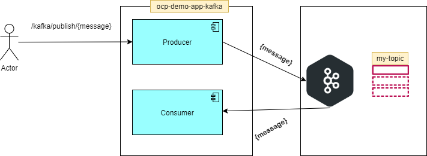
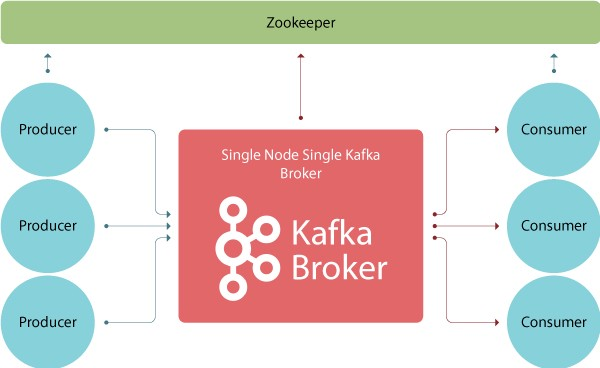
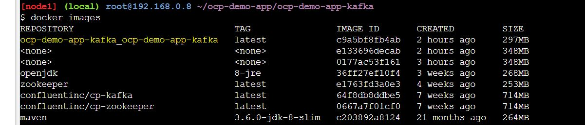
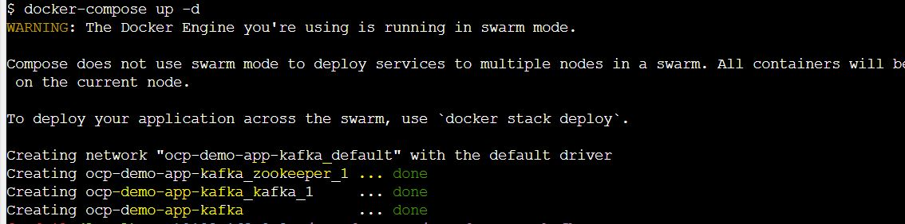
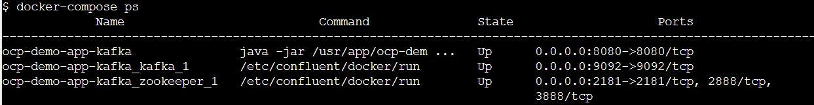
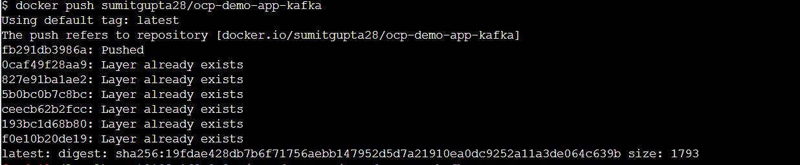
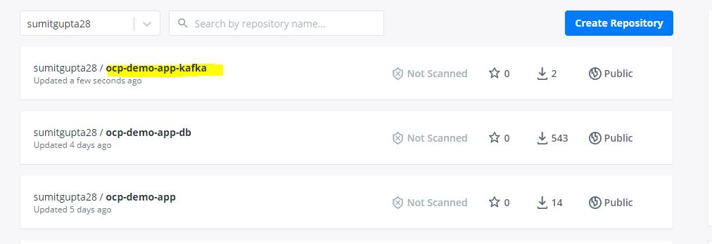

# OCP Demo APP

*	This is simple application to demonstrate the Spring boot application to kakfa connectivity.
*	Spring boot application will act as producer and consumer. 

 

# Build docker image and run

## Docker Compose

Compose is a tool for defining and running multi-container Docker applications. With Compose, you use a YAML file to configure your application’s services. 
Then, with a single command, you create and start all the services from your configuration. To learn more about all the features of Compose, see the list of features.
Compose works in all environments: production, staging, development, testing, as well as CI workflows. You can learn more about each case in Common Use Cases.
Using Compose is basically a three-step process:

1.  Define your app’s environment with a Dockerfile so it can be reproduced anywhere.
2.	Define the services that make up your app in docker-compose.yml so they can be run together in an isolated environment.
3.	Run docker-compose up and Compose starts and runs your entire app

Compose has commands for managing the whole lifecycle of your application:

*	Start, stop, and rebuild services
*	View the status of running services
*	Stream the log output of running services
*	Run a one-off command on a service

Make sure you are at folder /ocp-demo-app/ocp-demo-app-kafka and run below command

*   **build images**, this command will use the **DockerFile** to first create spring boot jar then build the image 
* 	This command will use the default file name **docker-compose.yml** 
* 	Just for demo purpose we are creating only 1-1 instance of zookeeper and kafka. 

* 	Here is the content of docker-compose.yml

	`
		version: '3.3'
		
		services:
		  zookeeper:
		    image: confluentinc/cp-zookeeper
		    ports:
		      - 2181:2181
		    environment:
		      - ALLOW_ANONYMOUS_LOGIN=yes
		      - ZOOKEEPER_CLIENT_PORT=2181
		
		
		  kafka:
		    image: confluentinc/cp-kafka
		    depends_on:
		      - zookeeper
		    ports:
		      - 9092:9092
		    environment:
		      - KAFKA_BROKER_ID=1
		      - KAFKA_ZOOKEEPER_CONNECT=zookeeper:2181
		      - KAFKA_ADVERTISED_LISTENERS=PLAINTEXT://localhost:9092
		      - KAFKA_LISTENER_SECURITY_PROTOCOL_MAP=PLAINTEXT:PLAINTEXT,PLAINTEXT_HOST:PLAINTEXT
		      - KAFKA_INTER_BROKER_LISTENER_NAME=PLAINTEXT
		      - KAFKA_OFFSETS_TOPIC_REPLICATION_FACTOR=1
		      - KAFKA_AUTO_CREATE_TOPICS_ENABLE=true
		      
		      
		  ocp-demo-app-kafka:
		    build: .
		    container_name: ocp-demo-app-kafka
		    depends_on:
		      - zookeeper
		      - kafka
		
		    ports:
		      - 8080:8080
		    environment:
		      - KAFKA_ENDPOINT=localhost:9092
      
      `

* 	Before running this , you would like to replace the **localhost** with your ip address. 

	$ sed -i 's/localhost|X.X.X.X/g'

*	Now lets **create/build** image for ocp-demo-app-kafka

	$ docker-compose build
	
	
* 	this command will create image for ocp-demo-app-kafka and you can verify this with docker images comamnd

	$ docker images
	
	
 
	
*   **run the application**, use below command to run the application

	$ docker-compose up -d

* 	This will also create a default network

 	

* 	here are the process,containers & images in use by docker-compose

 	

# Kubernetes

*	build image and push to docker hub	

*	use below commands to create image and tag and push to docker hub

*	go to folder /ocp-demo-app/ocp-demo-app-db

*	build image with required tag

	$ docker build . -t sumitgupta28/ocp-demo-app-kafka
	
*	this will create docker image with tag	**sumitgupta28/ocp-demo-app-kafka:latest**

*	docker login
	
	$ docker login

*	docker push

	$ docker push sumitgupta28/ocp-demo-app-kafka
	
	
 

 

