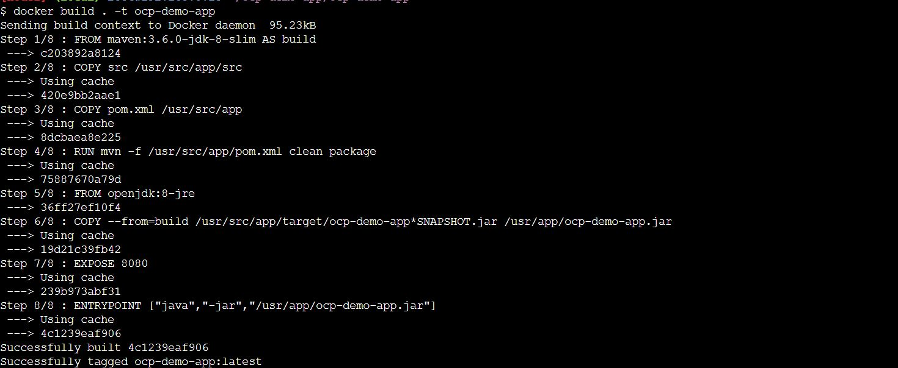
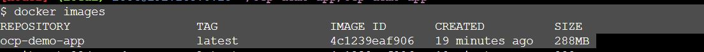
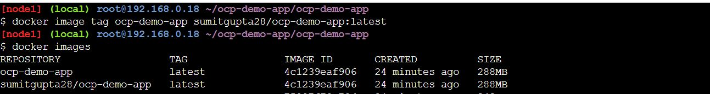
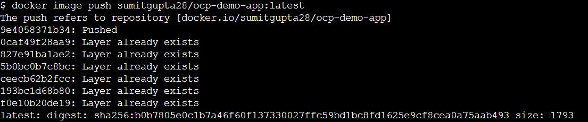

# OCP Demo APP

 
* this is simple application with 2 api's "/api/hello" and "/api/hello/{name}".
* just to demo the multi stage docker build for an java application
* run the container and validate it
* push the image into docker hub
* deploy application into openshift via docker image / docker file and s2i strategy.

## Build docker image 

Make sure you are at folder /ocp-demo-app/ocp-demo-app and run below command

	$docker build . -t ocp-demo-app

 

list the container 

	$docker images

 

Create a tag before pushing to docker hub. Here sumitgupta28 is my docker hub id , you need to change it as per your id.

	$docker image tag ocp-demo-app sumitgupta28/ocp-demo-app:latest

 

Push Image to docker hub , Here before push you need to login to docker hub using docker login command.

	$docker image push sumitgupta28/ocp-demo-app:latest

 
