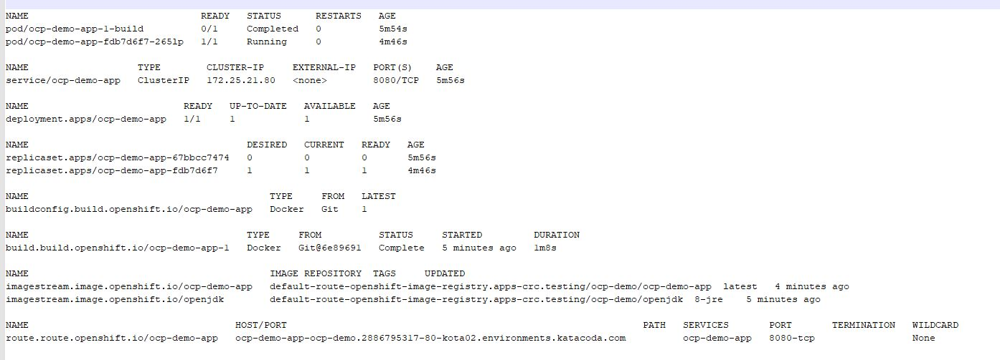
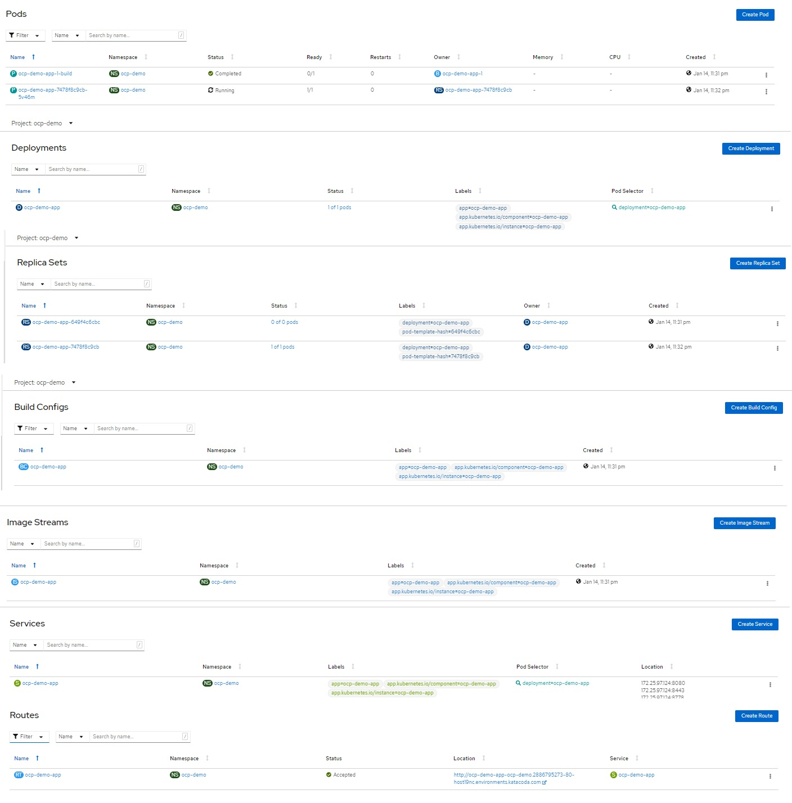

## Deploying ocp-demo-app into OpenShift Container

*	Ocp Container can deploy application in various way like S2I [Source to Image] , Docker File and Docker Image. 

### Docker FIle

 

*	Login as Developer	
	
	$ oc login -u developer -p developer

######output 

	Login successful.
	
	You don't have any projects. You can try to create a new project, by running
	
	    oc new-project <projectname>
	    
	    
*	Create a new Project	
	  
	$ oc new-project ocp-demo

######output 

	Now using project "ocp-demo" on server "https://openshift:6443".
	
	You can add applications to this project with the 'new-app' command. For example, try:
	
	    oc new-app ruby~https://github.com/sclorg/ruby-ex.git
	
	to build a new example application in Ruby. Or use kubectl to deploy a simple Kubernetes application:
	
	    kubectl create deployment hello-node --image=gcr.io/hello-minikube-zero-install/hello-node	  
	  
*	Lets deploy simple ocp-demo-app **[--strategy=docker]**

	$ oc new-app https://github.com/sumitgupta28/ocp-demo-app.git --context-dir=/ocp-demo-app --strategy=docker	
	
Here 
1.	**[https://github.com/sumitgupta28/ocp-demo-app.git]** is git hub url
2.	**[--context-dir=/ocp-demo-app]** subfolder which which will be looked for the DockerFile 	
3.	**[ --strategy=docker]** build Strategy dcoker , this will use the **/ocp-demo-app/DockerFile** to build the application
	

######Output

	--> Found container image 608a432 (3 days old) from Docker Hub for "openjdk:8-jre"
	
	    * An image stream tag will be created as "openjdk:8-jre" that will track the source image
	    * A Docker build using source code from https://github.com/sumitgupta28/ocp-demo-app.git will be created      * The resulting image will be pushed to image stream tag "ocp-demo-app:latest"
	      * Every time "openjdk:8-jre" changes a new build will be triggered
	
	--> Creating resources ...
	    imagestream.image.openshift.io "openjdk" created
	    imagestream.image.openshift.io "ocp-demo-app" created    buildconfig.build.openshift.io "ocp-demo-app" created
	    deployment.apps "ocp-demo-app" created    service "ocp-demo-app" created--> Success
	    Build scheduled, use 'oc logs -f bc/ocp-demo-app' to track its progress.   
	    
	    Application is not exposed. You can expose services to the outside world by executing one or more of the commands below:
	    
		'oc expose svc/ocp-demo-app'    Run 'oc status' to view your app.

*	**oc status** - Show overview of current project resources 
  
	 $ oc status

######Output

	In project ocp-demo on server https://openshift:6443
	svc/ocp-demo-app - 172.25.21.80:8080  deployment/ocp-demo-app deploys istag/ocp-demo-app:latest <-
	    bc/ocp-demo-app docker builds https://github.com/sumitgupta28/ocp-demo-app.git on istag/openjdk:8-jre
	      build #1 running for 56 seconds - 6e89691: updated readme. (Sumit <sumitgupta28@gmail.com>)
	    deployment #1 running for 58 seconds - 0/1 pods growing to 1
	
	
	1 info identified, use 'oc status --suggest' to see details.
	
	
*	**oc get all** - Lets see what all resource got created post this deployment
		

 

#### Lets Understand these

*	**buildconfig.build.openshift.io/ocp-demo-app** - This a build configuration to build a docker image from source.  
	
*	**pod/ocp-demo-app-1-build** - Pod to build the source to image

*	**imagestream.image.openshift.io/ocp-demo-app** - image stream to store the ocp-demo-app image

* 	**deployment.apps/ocp-demo-app** - deployment to deploy the ocp-demo-app image

* 	**replicaset.apps/ocp-demo-app** - replica set for deployment

* 	**pod/ocp-demo-app-fdb7d6f7-265lp** - Pod running the ocp-demo-app 

* 	**service/ocp-demo-app** - ocp-demo-app demo app service
 

#### Verify in OCP Console
	
 

#### final step, lets expose service. 

	$ oc expose service ocp-demo-app
	route.route.openshift.io/ocp-demo-app exposed
	
	
This will create a route 
	
	$ oc get routes.route.openshift.io
	NAME           HOST/PORT                                                              PATH   SERVICES       PORT       TERMINATION   WILDCARD
	ocp-demo-app   ocp-demo-app-ocp-demo.2886795317-80-kota02.environments.katacoda.com          ocp-demo-app   8080-tcp         None
	
Now test application 	
	
	$ curl http://ocp-demo-app-ocp-demo.2886795317-80-kota02.environments.katacoda.com/api/hello
	hello OCP

	$ curl http://ocp-demo-app-ocp-demo.2886795317-80-kota02.environments.katacoda.com/api/hello/Sumit
	hello Sumit$
	
#### Clean up

	$ oc delete all -l app=ocp-demo-app
	service "ocp-demo-app" deleted
	deployment.apps "ocp-demo-app" deleted
	buildconfig.build.openshift.io "ocp-demo-app" deleted
	build.build.openshift.io "ocp-demo-app-1" deleted
	imagestream.image.openshift.io "ocp-demo-app" deleted
	imagestream.image.openshift.io "openjdk" deleted
	route.route.openshift.io "ocp-demo-app" deleted

	
This will delete all the services/deployment/buildConfig/build/image stream/route for the ocp-demo-app

### Docker Image

Lets deploy simple ocp-demo-app with Docker Image

	$ oc new-app sumitgupta28/ocp-demo-app
	
	--> Found container image 4c1239e (10 days old) from Docker Hub for "sumitgupta28/ocp-demo-app"    * An image stream tag will be created as "ocp-demo-app:latest" that will track this image--> Creating resources ...
	    imagestream.image.openshift.io "ocp-demo-app" created
	    deployment.apps "ocp-demo-app" created
	    service "ocp-demo-app" created
	--> Success
	    Application is not exposed. You can expose services to the outside world by executing one or more of the commands below:
	     'oc expose svc/ocp-demo-app'
	    Run 'oc status' to view your app.
	

Here there is no build config.
	
	$ oc get all
	NAME                                READY   STATUS    RESTARTS   AGE
	pod/ocp-demo-app-65ffbd465d-lgh4g   1/1     Running   0          32s
	
	NAME                   TYPE        CLUSTER-IP      EXTERNAL-IP   PORT(S)    AGE
	service/ocp-demo-app   ClusterIP   172.25.137.49   <none>        8080/TCP   34s
	
	NAME                           READY   UP-TO-DATE   AVAILABLE   AGE
	deployment.apps/ocp-demo-app   1/1     1            1           34s
	
	NAME                                      DESIRED   CURRENT   READY   AGE
	replicaset.apps/ocp-demo-app-65ffbd465d   1         1         1       32s
	replicaset.apps/ocp-demo-app-67bbcc7474   0         0         0       34s
	
	NAME                                          IMAGE REPOSITORY  TAGS     UPDATED
	imagestream.image.openshift.io/ocp-demo-app   default-route-openshift-image-registry.apps-crc.testing/ocp-demo/ocp-demo-app  latest   32 seconds ago
	
	NAME                                    HOST/PORT                                                              PATH   SERVICES       PORT       TERMINATION   WILDCARD
	route.route.openshift.io/ocp-demo-app   ocp-demo-app-ocp-demo.2886795317-80-kota02.environments.katacoda.com          ocp-demo-app   8080-tcp                 None

#### Clean up

	$ oc delete all -l app=ocp-demo-app
	service "ocp-demo-app" deleted
	deployment.apps "ocp-demo-app" deleted
	imagestream.image.openshift.io "ocp-demo-app" deleted
	route.route.openshift.io "ocp-demo-app" deleted
	
This will delete all the services/deployment/image stream/route for the ocp-demo-app
	
