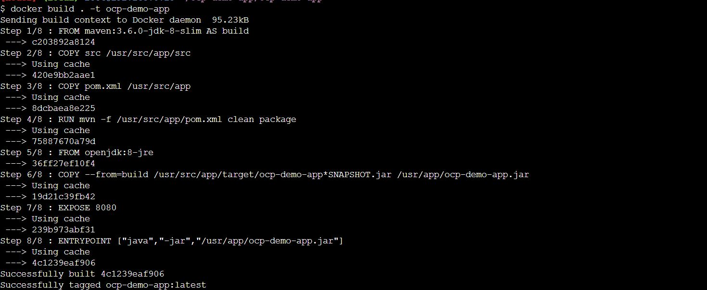
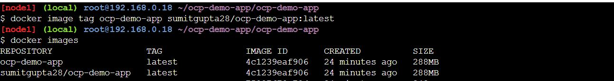

# OCP Demo APP

* this is simple application with 2 api's "/api/hello" and "/api/hello/{name}".
* just to demo the multi stage docker build for an java application
* run the container and validate it
* push the image into docker hub
* deploy application into openshift via docker image / docker file and s2i strategy.

## Build docker image and run

Make sure you are at folder /ocp-demo-app/ocp-demo-app and run below command

	$docker build . -t ocp-demo-app

 

here the build is 2 step process. first build the application and then build the image. 

this lines will first do the maven build

	FROM maven:3.6.0-jdk-8-slim AS build
	COPY src /usr/src/app/src
	COPY pom.xml /usr/src/app
	RUN mvn -f /usr/src/app/pom.xml clean package

this lines will use the jar created by build to make docker image with open-jdk-jre.
	
	FROM openjdk:8-jre
	COPY --from=build /usr/src/app/target/ocp-demo-app*SNAPSHOT.jar /usr/app/ocp-demo-app.jar 
	EXPOSE 8080
	ENTRYPOINT ["java","-jar","/usr/app/ocp-demo-app.jar"]

list the container 

	$docker images

 

Create a tag before pushing to docker hub. Here sumitgupta28 is my docker hub id , you need to change it as per your id.

	$docker image tag ocp-demo-app sumitgupta28/ocp-demo-app:latest

 

Push Image to docker hub , Here before push you need to login to docker hub using docker login command.

	$docker image push sumitgupta28/ocp-demo-app:latest

 

Verify docker hub

 

## Using Kubernetes to run the app. 

Since now we have image pushed into docker hub, so same image can be used to run the kubernetes [k8s] Deployment and Services. 

Here is the example Deployment and Service.

[deployment.yaml]

	`apiVersion: apps/v1
	kind: Deployment
	metadata:
	  name: ocp-demo-app ## Deployment Name
	spec:
	  selector:
	    matchLabels:
	      app: ocp-demo-app ## pod Labels
	  replicas: 3 ## Number of Replicas
	  template:
	    metadata:
	      labels:
	        app: ocp-demo-app
	    spec:
	      containers:
	      - name: ocp-demo-app ## POD Name
	        image: sumitgupta28/ocp-demo-app:latest ## Docker Image
	        ports:
	        - containerPort: 8080 ## port
	        livenessProbe:
	          httpGet:
	            path: /api/hello
	            port: ocp-demo-app
	          initialDelaySeconds: 30
	          timeoutSeconds: 1` 

	          
Below Command will create  Deployment of "ocp-demo-app:latest" image with 3 replicas

	$ kubectl create -f deployment.yaml

	
Here is the deployment status

	$ kubectl get deployments.apps
	NAME           READY   UP-TO-DATE   AVAILABLE   AGE
	ocp-demo-app   3/3     3            3           10m
	
Here is are the pods
	
	$ kubectl get pods
	NAME                            READY   STATUS    RESTARTS   AGE
	ocp-demo-app-658799b894-66s9c   1/1     Running   0          10m
	ocp-demo-app-658799b894-hljb6   1/1     Running   0          10m
	ocp-demo-app-658799b894-ktwkg   1/1     Running   0          10m
	

Deployment will create replica set as well. 
	
	$ kubectl get replicasets.apps
	NAME                      DESIRED   CURRENT   READY   AGE
	ocp-demo-app-658799b894   3         3         3       11m
	
	
now let;s create service

[service.yaml]

	`apiVersion: v1
	kind: Service
	metadata:
	  name: ocp-demo-app
	  labels:
	    app: ocp-demo-app
	spec:
	  type: NodePort
	  selector:
	    app: ocp-demo-app
	  ports:
	  - protocol: TCP
	    port: 8080
	    nodePort: 30080
	    name: http` 
	    
	    
	$ kubectl create -f service.yaml	 

check the service status

	$ kubectl get service
	NAME           TYPE        CLUSTER-IP       EXTERNAL-IP   PORT(S)          AGE
	kubernetes     ClusterIP   10.96.0.1        <none>        443/TCP          31m
	ocp-demo-app   NodePort    10.105.189.240   <none>        8080:30080/TCP   11m
	
	
try to access application.

	$ curl localhost:30080/api/hello
	hello OCP
	$ curl localhost:30080/api/hello/Sumit
	hello Sumit

	
 

 	