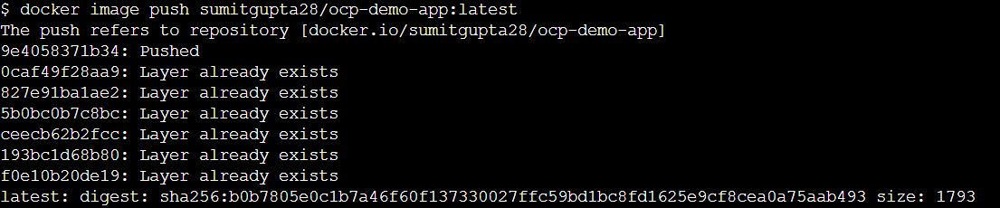

# OCP Demo APP

 
* this is simple application with 2 api's "/api/hello" and "/api/hello/{name}".
* just to demo the multi stage docker build for an java application
* run the container and validate it
* push the image into docker hub
* deploy application into openshift via docker image / docker file and s2i strategy.

## Build docker image 

Make sure you are at folder /ocp-demo-app/ocp-demo-app and run below command

	$docker build . -t ocp-demo-app

 

here the build is 2 step process. first build the application and then build the image. 

this lines will first do the maven build

	FROM maven:3.6.0-jdk-8-slim AS build
	COPY src /usr/src/app/src
	COPY pom.xml /usr/src/app
	RUN mvn -f /usr/src/app/pom.xml clean package

this lines will use the jar created by build to make docker image with open-jdk-jre.
	
	FROM openjdk:8-jre
	COPY --from=build /usr/src/app/target/ocp-demo-app*SNAPSHOT.jar /usr/app/ocp-demo-app.jar 
	EXPOSE 8080
	ENTRYPOINT ["java","-jar","/usr/app/ocp-demo-app.jar"]

list the container 

	$docker images

 

Create a tag before pushing to docker hub. Here sumitgupta28 is my docker hub id , you need to change it as per your id.

	$docker image tag ocp-demo-app sumitgupta28/ocp-demo-app:latest

 

Push Image to docker hub , Here before push you need to login to docker hub using docker login command.

	$docker image push sumitgupta28/ocp-demo-app:latest

 

Verify docker hub

 

